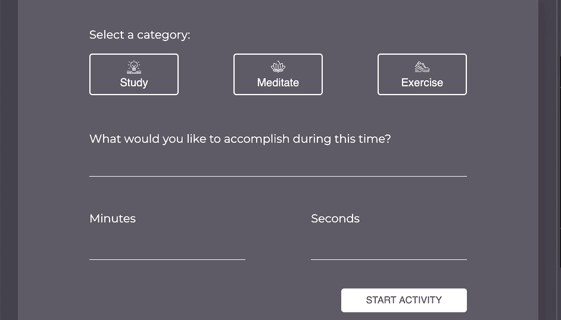
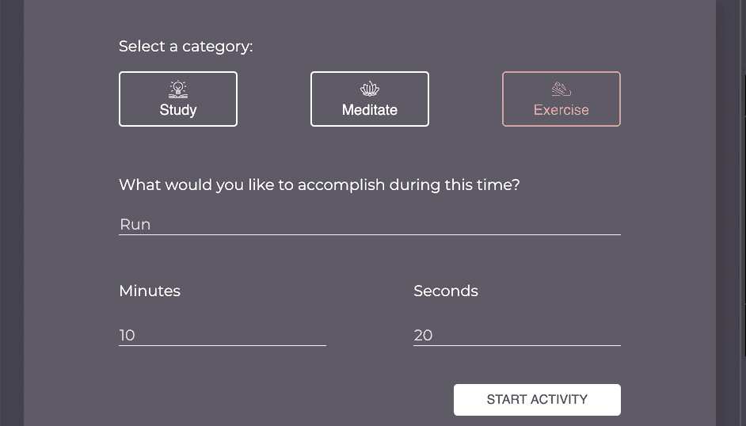
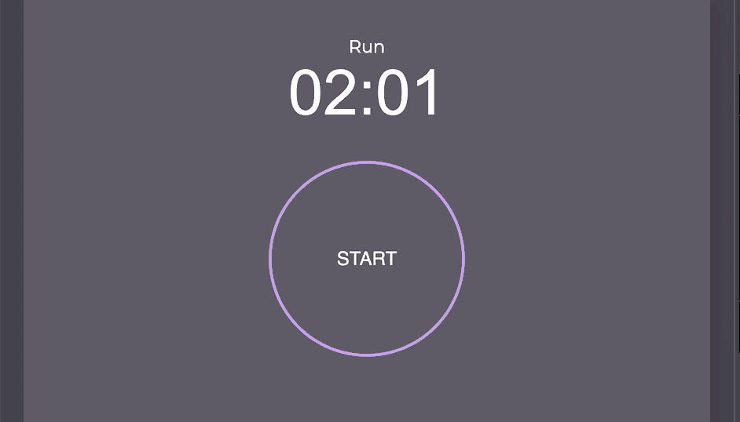

# Intention Timer

Intention Timer is an application that allows a user to set goals for their health and productivity, tied to an amount of time. Users can customize the timer by selecting an activity category, (either "Study", "Meditate", or "Exercise"), providing a short description of their goal, and decide on how many minutes and seconds the timer will count down. When a user finishes an activity, they can choose to log that activity and associated values to a collection of saved activities which they can review any time.

This project is the first group project of Turing School of Software and Design's 2005 FEE Mod 1 inning. The project is designed to develop our understanding of writing semantic html, conventional and responsive CSS, and functional JavaScript focusing on using querySelectors, eventListeners and event handler functions to create dynamic and developer-friendly applications that can use localStorage.

## Set Up Instructions
* Optional fork your own personal repo
* Clone repo to local directory using `git clone git@github.com:Abdeboskey/intention_timer.git`
* `open index.html` to open webpage

## Application and Functionality

### Setting Goals
* Users can select the type of activity they would like to do by selecting one of the three activity buttons on the top of the page.
* When a button is selected, it will change to a specific color associated with that activity. (Study: Green, Meditate: Purple, Exercise: Red)
* If a new button is selected, it will change to its associated color and all other buttons will change back to the default, unselected color.

* Users can set specific goals for each session by using the input field under the prompt "What would you like to accomplish during this time?"
* Users will then set the timer by entering a specific number of minutes and seconds into the associated input fields. Only numerical values can be accepted in these fields.

* If no activity button is selected, or any input fields are empty, an error message will display near the associated button/input field.

* If all parameters have been specified and the user clicks the "Start Activity" button, the input form will no longer display and instead we will see the user's goal, specified minutes and seconds, and a large round "START" button with the associated color of the selected activity type.

* When the "START" button is clicked, the timer will begin counting down.

* When the timer reaches 00:00 an alert will pop up and the option to log activity will appear.

* When the log activity button is clicked, the activity is logged in the past activities section.

* When the page is refreshed, the past activities display remains.

## Contributors

Intention Timer was built by [Jordy Shryock](https://github.com/jordy1611), [Stephanie Norton](https://github.com/NakiNorton) and [Aaron Burris-DeBoskey](https://github.com/Abdeboskey) between 5/26-6/3 2020, and can be seen in Github Pages deployment [Here](https://abdeboskey.github.io/intention_timer/).
